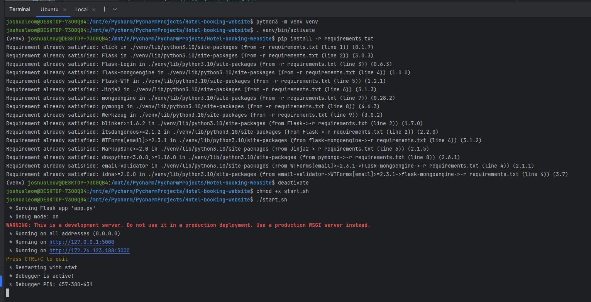

# Joshua Leow Hotel Website

## Project Overview

This project implements a web application for a Hotel, allowing guests to customize their stay and manage bookings. The application is built using Flask, a Python web framework, and incorporates responsive web design principles.

## Features

1. Room and Amenity Information
   - Display of available room types, bed types, and amenities
   - Responsive design for various screen sizes

2. User Authentication
   - User registration
   - Login and logout functionality
   - Flash messages for successful/unsuccessful actions

3. Booking System
   - Room booking for registered users
   - Display of user's bookings
   - Guest details management

4. Admin Functions
   - Upload hotel booking data
   - Check-in functionality
   - Booking trend visualization

## Technologies Used

- Backend: Flask (Python web framework)
- Frontend: HTML, CSS, JavaScript
- Database: MongoDB
- Additional Libraries: 
  - Bootstrap for responsive design
  - jQuery for AJAX calls
  - Chart.js for data visualization

## Key Components

1. About, Rooms, and Amenities Pages
   - Implemented using Jinja templating
   - Data stored in MongoDB

2. User Authentication System
   - Registration, login, and logout functionality
   - Session management

3. Booking Management
   - Room booking form with dynamic fields
   - Booking list display using Bootstrap list groups

4. Admin Panel
   - File upload for booking data
   - Check-in system with dropdown selection
   - Chart generation for booking trends

## Implementation Highlights

- Use of Jinja templating for dynamic content rendering
- AJAX calls for seamless user experience (e.g., check-in process)
- Responsive design using Bootstrap
- Data visualization using Chart.js
- MongoDB integration for data storage

## How to Run

<h4>Launch the Application: </h4>

```console
python3 -m venv venv
. venv/bin/activate
pip install -r requirements.txt
deactivate
chmod +x start.sh
./start.sh
```


<h4>View application in various screen sizes: </h4>


<h4>View MongoDB Database documents: </h4>


<h4>Register and Login feature: </h4>


<h4>Hotel Booking feature: </h4>


<h4>Admin upload csv file with list of bookings feature: </h4>


<h4>Admin check-in customer's booking feature: </h4>


<h4>Admin viewing line chart of Bookings by different Room Types: </h4>


